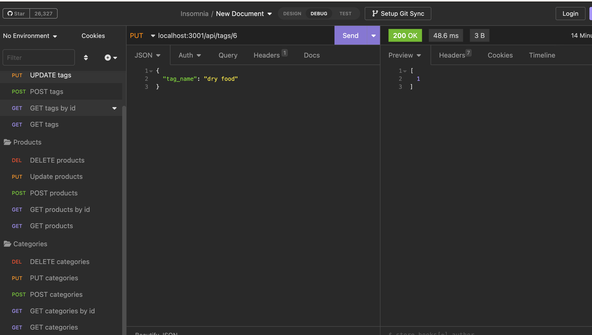

# E-Commerce Back End with Object-Relational Mapping (ORM)
User will use command-line application to interface with a database management system that allows e-commerce companies to view and manage information related to products, their categories and tag systems. 

## Description
This command-line application allows users to dynamically navigate informational datbases. User will use MySQL to initiate and run databases created with Sequelize. Databases are then seeded before running server with Node. Given use of api routes, user will be able to GET, POST, PUT, and DELETE APIs to successfully create, update, and delete data in database. The Insomnia application is used to test API functions.

[GitHub Repo](https://github.com/kristinbrewer/e-commerce-orm)

[Video Walk Through](https://drive.google.com/file/d/1THCxRWib0BigRQZBKC0hQ1FodXYgr5mM/view)

## Table of Contents
- [Description](#description)
- [Installation](#installation)
- [Usage](#usage)
- [License](#license)
- [Contributing](#contributing)
- [Tests](#tests)
- [Questions](#questions)

## Installation
Node.js (v16), MySQL, Express.js, Sequelize, Insomnia

## Usage
Run MySQL database, seed data with `npm run seed`, initialize program with `node server.js` and use of Insomnia for testing APIs

## License
MIT Copyright (c) 2022 kristinbrewer
Permission is hearby granted, free of charge, to any person obtaining a copy of this software and associated documentation files (the "Software"), to deal in the Software without restriction, including without limitation the rights to use, copy, modify, merge, publish, distribute, sublicense, and/or sell copies of the Software, and to permit persons to whom the Software is furnished to do so, subject to the following conditions: The above copyright notice and this permission notice shall be included in all copies or substantial portions of the Software. THE SOFTWARE IS PROVIDED ”AS IS”, WITHOUT WARRANTY OF ANY KIND, EXPRESS OR IMPLIED, INCLUDING BUT NOT LIMITED TO THE WARRANTIES OF MERCHANTABILITY, FITNESS FOR A PARTICULAR PURPOSE AND NONINFRINGEMENT. IN NO EVENT SHALL THE AUTHORS OR COPYRIGHT HOLDERS BE LIABLE FOR ANY CLAIM, DAMAGES OR OTHER LIABILITY, WHETHER IN AN ACTION OF CONTRACT, TORT OR OTHERWISE, ARISING FROM, OUT OF OR IN CONNECTION WITH THE SOFTWARE OR THE USE OR OTHER DEALINGS IN THE SOFTWARE. 

## Contributing
Kristin Brewer

## Tests
N/a

## Questions
For more information, my GitHub account is: [kristinbrewer](https://github.com/kristinbrewer).
Please email me at: brewer.kristin17@gmail.com with any additional questions. 